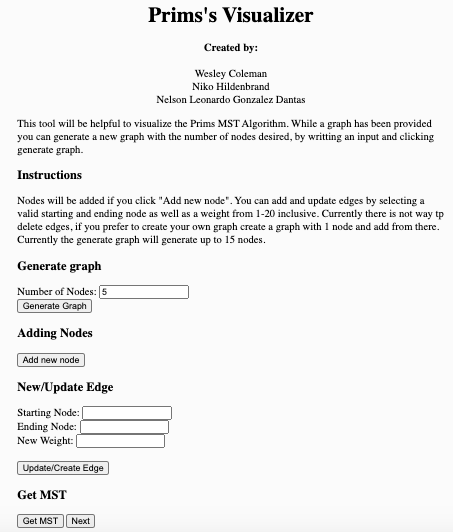

# Prims-Algorithm-Visualizer
To access the visualization, please follow the link below:

https://ldantas05.github.io/Prims-Algorithm-Visualizer/

To build this from scratch, with just the provided files. Please take PrimNode.js, Prims.js, index.html, sketch.js and style.css and input them into p5.js. Now to build this visualization simply click the play button at the top left of the screen. 

If you would rather run it locally navigate to the directory of the source files with your terminal program and run a local server. The easiest way to do this is by running: 
php -S 127.0.0.1:8000 
Open a browser window and navigate to http://localhost:8000 here you will find the web application.
What will be displayed on the right side of the screen is a graph consisting of 5 nodes, all with weighted edges to each other. A very unique piece of this visualization is the ability  to move nodes around the screen, while still keeping the edges and weights the same.  Notice that when you click on a node to move, the color of that node changes. You will also see an intro to our visualization above this, along with a number of different boxes and buttons that can be used to customize the graph. 

The first box you see labeled “Number of Nodes”, allows you to input a specific number of nodes, up to 15, and hit the button, “Generate Graph”, to create a new graph with your specified number of nodes. Again all nodes will have weighted edges to the other nodes in the graph.

The next button you see is “Add new node”. This will add a new node to the already generated graph.This allows for a bit more freedom, as more than 15 nodes can be added. 

Finally, the last three boxes you see “Starting Node”, “Ending Node”, and “New Weight” , have very nice functions. They can be used in two different ways. The first being updating a current weight in the graph with a new weight, going from the specified start node to end node. The other way this can be used is after adding a new node to the graph, connecting this node, to a node of your choice and specifying that weight. To implement this, simple click the “Update/Create Edge” button.

Lastly, and most importantly we have the “Get MST” button and “Next” button. Get MST highlights all the nodes in the graph that are included in the MST, which will be all nodes. The next button allows you to iterate through and see each edge being highlighted that is included in the minimum spanning tree according to Prim’s algorithm. 

# Sample Results
The visual you see below is the screen you will be prompted to first when you run the program. As described above, this gives you numerous different options to choose from when constructing your graph and really allows for customization when running through this algorithm. Throughout this results section, we will take you through how each of these buttons work, and the output that they will provide. 

    

This next gif is an example of a graph that is generated when the link is clicked
and the play button is pressed. As we discussed earlier, and now only confirming, we have 5 nodes generated, each with a weighted edge to the other nodes. You can also see how easy it is to move nodes from one place to another while also keeping the same weights and edges. Additionally, we can easily see which node is being selected through the change of color inside the node.

    

Let us now say that we want to generate a graph with 10 nodes, I simply type into the “Number of Nodes” box, 10. The output is shown below.

    

Below we can see an implementation of changing the weight of an edge between two already existing nodes. Like described above, we can simply type into “Starting Node” and “Ending Node” and then specify our new weight in “New Weight.” We also see the “Add new node” button, which like it sounds, is to add another node. We can then connect this node to the graph with the feature shown below. 

    

Now can see the implementation of both the “Get MST” button and the “Next” button. Starting with the “Get MST” button. When we hit this button all of the nodes in the MST are highlighted in orange, which as you would expect, is all of them. The “Next” button is where the real visualization comes in. Everytime this button is hit, the algorithm iterates through and highlights the first edge in Prim’s MST. This can be clicked continuously until the console log give us “Full tree found.” An example of how this works is shown below.

    

 
